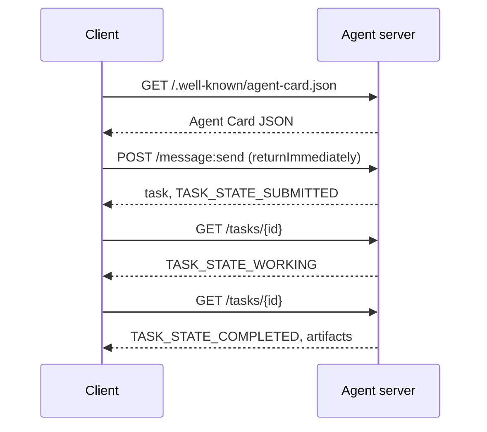

# A2A  بروتوكول العميل إلى العميل

> أعلنت جوجل عن A2A في أبريل 2025؛ بحلول أبريل 2026 فإن المواصفات ستكون في https://a2a-protocol.org/latest/specification/و 150 منظمة تدعمها A2A هو المكمل الأفقي لمكبرات التنفيذ (المدرس 13): حيث أن MCP عمودي (مكبرات ) ، A2A هو من ذوي الصلة (مكبر ) يحدد بطاقات العميل (الاكتشاف) ، والمهام مع الأثاث (النص، البيانات المهيكلة، الفيديو) ، دورات حياة المهام غير الشفافة، والمواد. أنظمة الإنتاج تزداد إماية MCP مع A2A. أطلقت Google Cloud دعم A2A في Vertex AI Agent Builder خلال 2025-2026.

**Type:** Learn + Build
**Languages:** Python (stdlib, `http.server`, `json`)
**Prerequisites:** Phase 16 · 04 (Primitive Model)
**Time:** ~75 minutes

## المشكلة

وكيلك يحتاج إلى الاتصال بعامل آخر في نظام آخر. كيف؟ يمكنك كشف نقطة نهاية HTTP، وتعريف مخطط JSON مخصص، وتأمل الجانب الآخر يتحدث ذلك. كل زوج من العاملين يصبح دمج مخصص.

A2A هو بروتوكول الأسلاك العالمي لهذا المكالمة. اكتشاف قياسي، نموذج مهمة قياسي، النقل القياسي، الأثاث القياسي. مثل HTTP+REST ولكن للعملاء كمواطنين من الدرجة الأولى.

## المفهوم

### العناصر الأربعة

**Agent Card.**وثيقة JSON في `/.well-known/agent-card.json`وصف الوكيل: الاسم والمهارات`supportedInterfaces`(URL نقطة النهاية، التزاما بالبروتوكول، نسخة بروتوكول) ، وأنواع الإدخال والإخراج المتبنية، ومتطلبات الوصول (`securitySchemes`بالإضافة`securityRequirements`"الاكتشاف يحدث من خلال قراءة البطاقة"

```http
GET /.well-known/agent-card.json HTTP/1.1
Host: agent.example.com
```

```json
{
  "name": "code-review-agent",
  "description": "Reviews Python and TypeScript code.",
  "version": "1.0.0",
  "supportedInterfaces": [
    {
      "url": "https://agent.example.com",
      "protocolBinding": "HTTP+JSON",
      "protocolVersion": "1.0"
    }
  ],
  "capabilities": {"streaming": false, "pushNotifications": false},
  "securitySchemes": {
    "bearer": {"httpAuthSecurityScheme": {"scheme": "Bearer"}}
  },
  "securityRequirements": [{"schemes": {"bearer": {"list": []}}}],
  "defaultInputModes": ["text/plain", "application/json"],
  "defaultOutputModes": ["application/json"],
  "skills": [
    {
      "id": "review-python",
      "name": "Review Python",
      "description": "Reviews Python code.",
      "tags": ["code-review", "python"]
    },
    {
      "id": "review-typescript",
      "name": "Review TypeScript",
      "description": "Reviews TypeScript code.",
      "tags": ["code-review", "typescript"]
    }
  ]
}
```

**Task.**وحدة العمل، كائن غير متوافق، مع دورة حياة:`TASK_STATE_SUBMITTED``TASK_STATE_WORKING``TASK_STATE_COMPLETED`- لا ، لا`TASK_STATE_FAILED`- لا ، لا`TASK_STATE_CANCELED`يقوم العميل بإرسال رسالة، و يقوم الخادم بإنشاء المهمة، و يقوم العميل بإجراء استطلاعات أو الاشتراك في التحديثات.

**Artifact.**نوع النتيجة التي تنتجها المهمة. النص، JSON المهيكلة، الصورة، الفيديو، الصوت. يتم كتابة الأدوات: كل جزء يحمل واحد من `text`،`raw`،`url`أو`data`ويمكن أن يسميها`mediaType`، لذا الوسائل المختلفة هي من الدرجة الأولى.

**Opaque lifecycle.**A2A لا يصف * كيف * يقوم وكيل عن بعد بحل المهمة. يرى العميل عمليات الانتقال والتحفيرات الحالة. التنفيذ حر في استخدام أي إطار.

### الانقسام بين MCP/A2A

- **MCP**(الدرس 13): الوكيل  أداة. الوكيل يقرأ/يكتب عبر JSON-RPC إلى خادم الأداة. بدون حالة افتراضية.
- **A2A**: العميل  العميل. بروتوكول الأقران. كلا الجانبين هم عملاء مع التفكير الخاص بهم.

تستخدم أنظمة الإنتاج متعددة الوكلاء كلاهما. يطلق أقر A2A أدوات MCP على جانبه. يحتفظ الانقسام بالاهتمامات المختلفة.

### تدفق الاكتشافات



هذه هي طرق ربط HTTP + JSON ، وكل طلب يحمل `A2A-Version: 1.0`. بطبيعة الحال`SendMessage`يُغلق حتى تصل المهمة إلى حالة نهاية أو انقطاع، لذا يحدد عميل الاستطلاع `configuration.returnImmediately`لكي تعيدوا المهمة فوراً

أو مع البث: `POST /message:stream`يعيد الأحداث المرسلة من الخادم (a `task`أولاً، ثم`statusUpdate`و`artifactUpdate`الأحداث) ، و`/tasks/{id}:subscribe`يربط مرة أخرى بمهمة جارية. يغلق التيار عندما تصل المهمة إلى حالة نهائية. لا يوجد `final`العلم

### المُصدر

A2A تدعم ثلاثة أنماط مشتركة:

- **Bearer token**: OAuth2 أو غير شفاف (`httpAuthSecurityScheme`أو`oauth2SecurityScheme`)
- **mTLS**: التلفزيون المتبادل؛ المؤسسات تثبت الهوية لبعضها البعض (`mtlsSecurityScheme`)
- **API key**: مفتاح في عنوان، وبرامج استفسار، أو ملف تعريف الارتباط (`apiKeySecurityScheme`)

المعتاد يُعلن في بطاقة العميل:`securitySchemes`أسماء كل خطة و`securityRequirements`يحدد أيّة من هذه المواصفات يجب أن يرضيها العميل.

### 150 منظمة+ بحلول أبريل 2026

وقد دفع تبني المؤسسات مقياس A2A. أصبح عنوان: A2A هو الطريقة التي تتخطى بها أنظمة وكلاء المؤسسات حدود الثقة. أرسلت Google Cloud دعم Vertex AI Agent Builder A2A؛ تدعمها Microsoft Agent Framework؛ وأغلب الإطارات الرئيسية (LangGraph، CrewAI، AutoGen) أرسلت مبرمجي A2A.

### حيث A2A تفوز

- **Cross-organization calls.**عميل في الشركة A يطلب عميل في الشركة B. بدون A2A، كل زوج هو عقد مخصص.
- **Heterogeneous frameworks.**عميل (لانغغراف) يطلب عميل (كرو آي آي) يطلب عميل (بايثون) المخصص
- **Typed artifacts.**نتيجة الفيديو، JSON المهيكلة، الصوت  كل من الدرجة الأولى.
- **Long-running tasks.**دورة الحياة غير الشفافة + استطلاع للرأي يجعل المهام التي تستغرق ساعات من الوقت سهلة.

### حيث A2A تكافح

- **Latency-sensitive micro-calls.**دورة حياة A2A غير متزامن. الوكيل إلى الوكيل في السبت لا يناسب؛ استخدم RPC مباشرة.
- **Tight-coupled in-process agents.**إذا كان كلا العاملين يعملون في نفس عملية Python، رحلة HTTP ذهاب وإياب A2A هو أكثر من اللازم.
- **Small teams.**تكاليف الطيران المحددة حقيقية، وكلاء الداخلية فقط قد لا تحتاج إلى الإجراءات الرسمية.

### A2A مقابل ACP، ANP، NLIP

ظهرت العديد من المواصفات ذات الصلة في 2024-2026:

- **ACP**(IBM/Linux Foundation)  السابقة لـ A2A، نطاق أصغر.
- **ANP**(بروتوكول شبكة العملاء)  اكتشاف الأقران-ثقيل، لامركزية-أول.
- **NLIP**(بروتوكول تفاعل اللغة الطبيعية ECMA، الموحد ديسمبر 2025)  نوع محتوى اللغة الطبيعية.

A2A هو بروتوكول الأقران الأكثر اعتمادًا اعتبارًا من أبريل 2026. انظر arXiv:2505.02279 (Liu et al., "مراجعة بروتوكولات التفاعلية مع العاملين") للمقارنة.

```figure
sw-agent-card-discovery
```

## بناءها

`code/main.py`ينفذ خادم و عميل A2A- على الأقل باستخدام `http.server`و JSON، على التماس 1.0 HTTP + JSON. الخادم:

- يُعرض`/.well-known/agent-card.json`،
- يوافق`POST /message:send`،
- يدير حالة المهمة،
- يعيد الأثاث على `GET /tasks/{id}`. . .

العميل:

- يحضر بطاقة العميل
- يرسل رسالة مع `returnImmediately`،
- استطلاعات الرأي حتى الانتهاء
- يقرأ الأثاث

أركض

```
python3 code/main.py
```

النص يبدأ الخادم في خيط خلفي، ثم يدير العميل ضد ذلك. ترى التدفق الكامل: اكتشاف، تقديم، استطلاع، الفن.

## استخدمها

`outputs/skill-a2a-integrator.md`تصميمات إندماج A2A: محتويات بطاقة الوكيل، مخططات المهام، اختيار المؤلف، البث مقابل استطلاعات الرأي.

## أرسله

قائمة التحقق:

- **Pin the spec version.**A2A لا يزال يتطور`supportedInterfaces`الإدخال يعلن عن`protocolVersion`، والعملاء يرسلون`A2A-Version: 1.0`. . .
- **Idempotent task creation.**يجب أن تنتج عمليات الإرسال المكرر (تجربات الشبكة) مهمة واحدة.`messageId`. . .
- **Artifact schemas.**إعلان ما هي الأشكال التي يعيدها الوكيل؛ يجب على المستهلكين التحقق منها.
- **Rate limits + auth.**A2A هو عامة، تطبق أمن الويب القياسي.
- **Dead-letter for failed tasks.**تحقق من الأنماط مع مرور الوقت من أنواع الفشل المتكرر.

## التمارين

1. أركض`code/main.py`تأكد من أن العميل اكتشف الخادم ويحصل على الفن الصحيح
2. إضافة مهارة ثانية إلى الخادم (على سبيل المثال ، "التخميز"). قم بتحديث بطاقة الوكيل. اكتب عميلا يختار المهارة بناء على نوع المهمة. طلب 1.0 ليس لديه مجال مهارات ، لذلك يقوم الخادم بتوجيه أجزاء الرسالة.
3. تنفيذ`POST /message:stream`: الإجابة مع الحوادث المرسلة من الخادم (a `task`أولاً، ثم`statusUpdate`الحوادث) و إغلاق التيار في حالة نهاية. ما الذي يحتاج العميل إلى القيام به بشكل مختلف؟
4. اقرأوا مواصفات A2A (https://a2a-protocol.org/latest/specification/) حدد ثلاثة أشياء لا تنفذها هذه المواصفات المحددة.
5. مقارنة A2A (اكتشاف بطاقة العميل) مع MCP (إدراج قدرات جانب الخادم عبر `listTools`ما هي التنازل بين العملاء الذين يصفون أنفسهم واختبار القدرات؟

## الشروط الرئيسية

| Term | What people say | What it actually means |
|------|----------------|------------------------|
| A2A | "Agent-to-agent" | Peer protocol for agents to call other agents across systems. Google 2025. |
| Agent Card | "The agent's business card" | JSON at `/.well-known/agent-card.json` describing skills, `supportedInterfaces`, auth. |
| Task | "The unit of work" | Async stateful object with a lifecycle; artifacts produced on completion. |
| Artifact | "The result" | Typed output: text, structured JSON, image, video, audio. First-class media. |
| Opaque lifecycle | "How it's solved is the agent's business" | Client sees state transitions; server is free to choose framework/tools. |
| Discovery | "Finding the agent" | `GET /.well-known/agent-card.json` returns the card. |
| MCP vs A2A | "Tools vs peers" | MCP: vertical agent ↔ tool. A2A: horizontal agent ↔ agent. |
| ACP / ANP / NLIP | "Sibling protocols" | Adjacent specs; A2A is the most-adopted 2026. |

## المزيد من القراءة

- [A2A specification](https://a2a-protocol.org/latest/specification/) المواصفات القنونية
- [A2A v1.0.1 release](https://github.com/a2aproject/A2A/tree/v1.0.1): المسموح بها`docs/specification.md`و`specification/a2a.proto`هذا الدرس يتبع
- [Google Developers Blog — A2A announcement](https://developers.googleblog.com/en/a2a-a-new-era-of-agent-interoperability/) شهر أبريل 2025
- [A2A GitHub repo](https://github.com/a2aproject/A2A) تنفيذات مرجعية و SDKs
- [Liu et al. — A Survey of Agent Interoperability Protocols](https://arxiv.org/html/2505.02279v1) مقارنة MCP, ACP, A2A, ANP
