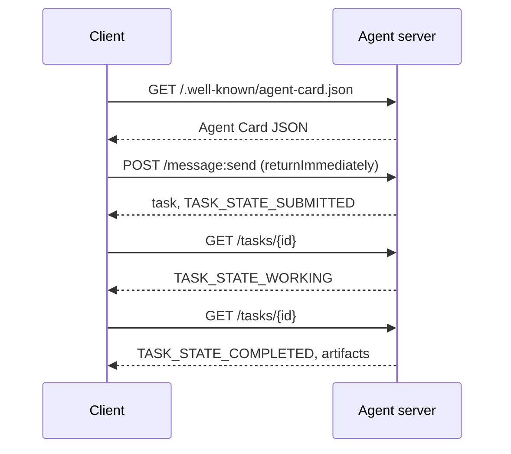

# A2A  Le protocole agent-agent

> Google a annoncé A2A en avril 2025; en avril 2026, la spécification est à https://a2a-protocol.org/latest/specification/et plus de 150 organisations le soutiennent. A2A est le complément horizontal du MCP (leçon 13): là où le MCP est vertical (agent  outils), A2A est peer-to-peer (agent  agent). Il définit les cartes d'agent (découverte), les tâches avec des artefacts (texte, données structurées, vidéo), les cycles de vie opaques des tâches et auth. Les systèmes de production associent de plus en plus MCP à A2A. Google Cloud a introduit le support A2A dans Vertex AI Agent Builder pendant les années 2025-2026.

**Type:** Learn + Build
**Languages:** Python (stdlib, `http.server`, `json`)
**Prerequisites:** Phase 16 · 04 (Primitive Model)
**Time:** ~75 minutes

## Problème

Vous pouvez exposer un point d'extrémité HTTP, définir un schéma JSON sur mesure, et espérer que l'autre côté parle. Chaque paire d'agents devient une intégration personnalisée.

A2A est le protocole de communication universel pour cet appel. Découverte standard, modèle de tâche standard, transport standard, objets standard. Comme HTTP+REST mais pour les agents en tant que citoyens de première classe.

## Concept

### Les quatre éléments

**Agent Card.**Un document JSON à `/.well-known/agent-card.json`décrire l'agent: nom, compétences, `supportedInterfaces`(URL de point final, liaison du protocole, version du protocole), types de médias d'entrée et de sortie par défaut, et exigences d'auth (`securitySchemes`plus `securityRequirements`La découverte se fait en lisant la carte.

```http
GET /.well-known/agent-card.json HTTP/1.1
Host: agent.example.com
```

```json
{
  "name": "code-review-agent",
  "description": "Reviews Python and TypeScript code.",
  "version": "1.0.0",
  "supportedInterfaces": [
    {
      "url": "https://agent.example.com",
      "protocolBinding": "HTTP+JSON",
      "protocolVersion": "1.0"
    }
  ],
  "capabilities": {"streaming": false, "pushNotifications": false},
  "securitySchemes": {
    "bearer": {"httpAuthSecurityScheme": {"scheme": "Bearer"}}
  },
  "securityRequirements": [{"schemes": {"bearer": {"list": []}}}],
  "defaultInputModes": ["text/plain", "application/json"],
  "defaultOutputModes": ["application/json"],
  "skills": [
    {
      "id": "review-python",
      "name": "Review Python",
      "description": "Reviews Python code.",
      "tags": ["code-review", "python"]
    },
    {
      "id": "review-typescript",
      "name": "Review TypeScript",
      "description": "Reviews TypeScript code.",
      "tags": ["code-review", "typescript"]
    }
  ]
}
```

**Task.**Un objet asynchrone, étalé avec un cycle de vie:`TASK_STATE_SUBMITTED`- Je suis là.`TASK_STATE_WORKING`- Je suis là.`TASK_STATE_COMPLETED`- Je suis là .`TASK_STATE_FAILED`- Je suis là .`TASK_STATE_CANCELED`Un client envoie un message, le serveur crée la tâche, et le client vote ou s'abonne aux mises à jour.

**Artifact.**Le type de résultat produit par une tâche. texte, JSON structuré, image, vidéo, audio.`text`- Je suis là .`raw`- Je suis là .`url`ou `data`et peut nommer son `mediaType`, donc les différentes modalités sont de première classe.

**Opaque lifecycle.**A2A ne précise pas *comment* l'agent à distance résout la tâche.Le client voit les transitions d'état et les artefacts; la mise en œuvre est libre d'utiliser n'importe quel cadre.

### Le MCP/A2A est divisé

- **MCP**(Léction 13): agent  outil. L'agent lit/écrit via JSON-RPC à un serveur d'outils.
- **A2A**Le protocole de parité; les deux parties sont des agents avec leur propre raisonnement.

Les systèmes de production multi-agents utilisent les deux. un paire A2A appelle les outils MCP de son côté. La division garde les deux problèmes propres.

### Flux de découverte



Ce sont les routes de liaison HTTP+JSON, et chaque requête est accompagnée `A2A-Version: 1.0`- Par défaut .`SendMessage`bloquements jusqu'à ce que la tâche atteigne un état terminal ou interrompu, de sorte qu'un client de sondage définit `configuration.returnImmediately`pour récupérer la tâche immédiatement.

Ou avec le streaming: `POST /message:stream`renvoie les événements envoyés par le serveur (a `task`D'abord, puis`statusUpdate`et `artifactUpdate`événements), et `/tasks/{id}:subscribe`Le flux se ferme lorsque la tâche atteint un état terminal; il n'y a pas de `final`Le drapeau.

### Autre

A2A prend en charge trois modèles communs:

- **Bearer token**: OAuth2 ou opaque (`httpAuthSecurityScheme`ou `oauth2SecurityScheme`)
- **mTLS**: TLS mutuel; les organisations se prouvent l'identité (`mtlsSecurityScheme`)
- **API key**: une clé dans un en-tête, un paramètre de requête ou un cookie (`apiKeySecurityScheme`)

L' authenticité est déclarée dans la carte d' agent: `securitySchemes`nom de chaque régime et `securityRequirements`Les clients découvrent et se conforment.

### 150 organisations d'ici à avril 2026

L'adoption par l'entreprise a conduit à l'échelle A2A. Le titre: A2A est devenu la façon dont les systèmes d'agents d'entreprise traversent les frontières de la confiance. Google Cloud a livré le support Vertex AI Agent Builder A2A; Microsoft Agent Framework le prend en charge; la plupart des principaux frameworks (LangGraph, CrewAI, AutoGen) expédient des adaptateurs A2A.

### Où A2A gagne

- **Cross-organization calls.**L'agent de la compagnie A appelle l'agent de la compagnie B. Sans A2A, chaque paire est un contrat sur mesure.
- **Heterogeneous frameworks.**L'agent LangGraph appelle l'agent CrewAI appelle l'agent Python personnalisé.
- **Typed artifacts.**Résultat vidéo, JSON structuré, audio  tout premier niveau.
- **Long-running tasks.**Le cycle de vie opaque + les sondages simplifient les tâches d'une durée d'une heure.

### Où A2A lutte

- **Latency-sensitive micro-calls.**Le cycle de vie de l'A2A est asynchrone.
- **Tight-coupled in-process agents.**Si les deux agents fonctionnent dans le même processus Python, le retour HTTP d'A2A est exagéré.
- **Small teams.**Les frais généraux sont réels; les agents internes ne peuvent avoir besoin de la formalité.

### A2A contre ACP, ANP, NLIP

Plusieurs spécifications connexes ont été émises en 2024-2026:

- **ACP**(IBM/Linux Foundation)  Prédécesseur à A2A, portée plus étroite.
- **ANP**(Protocole de réseau d'agents)  Peer-discovery-heavy, décentralisé-first.
- **NLIP**(Protocole d'interaction linguistique naturelle ECMA, normalisé décembre 2025)  type de contenu en langue naturelle.

A2A est le protocole de pairs le plus adopté en avril 2026. Voir arXiv:2505.02279 (Liu et coll., "Un sondage des protocoles d'interopérabilité des agents") pour la comparaison.

```figure
sw-agent-card-discovery
```

## Faites-le

`code/main.py`met en œuvre un serveur et un client A2A minimaux en utilisant `http.server`et JSON, sur la liaison HTTP + JSON 1.0. Le serveur:

- exposés `/.well-known/agent-card.json`- Je suis désolé .
- accepte `POST /message:send`- Je suis désolé .
- gère l'état des tâches,
- retourne des objets sur `GET /tasks/{id}`- Je suis désolé .

Le client:

- Il vient chercher la carte d'agent,
- envoie un message avec `returnImmediately`- Je suis désolé .
- les sondages jusqu'à leur fin,
- Il lit l'artefact.

Je vais courir .

```
python3 code/main.py
```

Le script démarre le serveur dans un fil d'arrière-plan, puis le client contre lui. Vous voyez le flux complet: découverte, soumission, sondage, artefact.

## Utilisez-le

`outputs/skill-a2a-integrator.md`Il propose une intégration A2A: contenu de la carte d'agent, schémas de tâches, choix d'auteur, streaming et sondage.

## La faire partir

Liste de contrôle:

- **Pin the spec version.**A2A est toujours en évolution; chaque `supportedInterfaces`l' entrée déclare son `protocolVersion`, et les clients envoient`A2A-Version: 1.0`- Je suis désolé .
- **Idempotent task creation.**Les répétitions de données (réessayes réseau) doivent produire une seule tâche.`messageId`- Je suis désolé .
- **Artifact schemas.**Déclarer les formes que le vendeur retourne; les consommateurs doivent valider.
- **Rate limits + auth.**A2A est ouvert au public; appliquez la sécurité Web standard.
- **Dead-letter for failed tasks.**Inspecter les modèles au fil du temps pour les types de défaillances récurrentes.

## Exercices

1. On court .`code/main.py`Confirmez que le client découvre le serveur et reçoit l'artefact correct.
2. Ajouter une deuxième compétence au serveur (par exemple, " résumer "). Mise à jour la carte d'agent. Écrivez un client qui choisit la compétence en fonction du type de tâche. Une requête 1.0 n'a pas de champ de compétence, donc le serveur route sur les parties du message.
3. Mise en œuvre `POST /message:stream`: réponse avec les événements envoyés par le serveur (a `task`D'abord, puis`statusUpdate`Les clients doivent-ils faire différemment?
4. Lire la spécification A2A (https://a2a-protocol.org/latest/specification/) Identifier trois éléments que les spécifications ne mettent pas en œuvre dans cette démo.
5. Comparez A2A (découverte de carte d' agent) à MCP (liste de capacités côté serveur via `listTools`Quelle est la différence entre les agents qui se décrivent eux-mêmes et ceux qui testent leurs capacités?

## Les termes clés

| Term | What people say | What it actually means |
|------|----------------|------------------------|
| A2A | "Agent-to-agent" | Peer protocol for agents to call other agents across systems. Google 2025. |
| Agent Card | "The agent's business card" | JSON at `/.well-known/agent-card.json` describing skills, `supportedInterfaces`, auth. |
| Task | "The unit of work" | Async stateful object with a lifecycle; artifacts produced on completion. |
| Artifact | "The result" | Typed output: text, structured JSON, image, video, audio. First-class media. |
| Opaque lifecycle | "How it's solved is the agent's business" | Client sees state transitions; server is free to choose framework/tools. |
| Discovery | "Finding the agent" | `GET /.well-known/agent-card.json` returns the card. |
| MCP vs A2A | "Tools vs peers" | MCP: vertical agent ↔ tool. A2A: horizontal agent ↔ agent. |
| ACP / ANP / NLIP | "Sibling protocols" | Adjacent specs; A2A is the most-adopted 2026. |

## Pour en savoir plus

- [A2A specification](https://a2a-protocol.org/latest/specification/) la spécificité canonique
- [A2A v1.0.1 release](https://github.com/a2aproject/A2A/tree/v1.0.1): les étiquettes `docs/specification.md`et `specification/a2a.proto`Cette leçon suit
- [Google Developers Blog — A2A announcement](https://developers.googleblog.com/en/a2a-a-new-era-of-agent-interoperability/) Le lancement en avril 2025
- [A2A GitHub repo](https://github.com/a2aproject/A2A) Implémentations de référence et KDD
- [Liu et al. — A Survey of Agent Interoperability Protocols](https://arxiv.org/html/2505.02279v1) Comparaison des PAM, ACP, A2A, PAN
