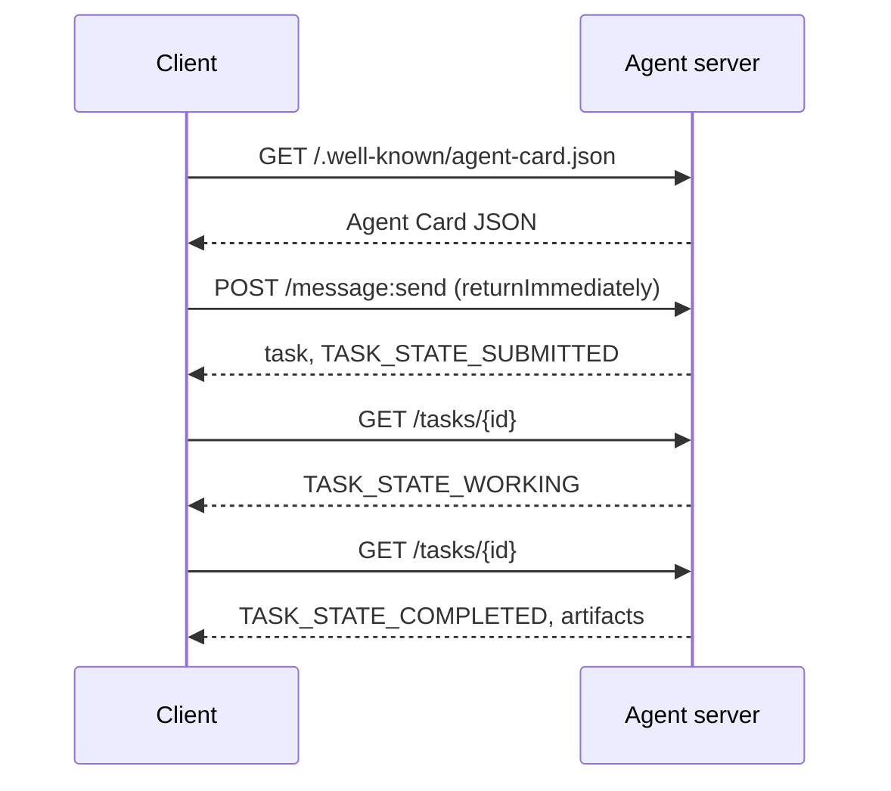

# A2A  एजेंट-ए-एजेंट प्रोटोकॉल

> गूगल ने अप्रैल 2025 में A2A की घोषणा की; अप्रैल 2026 तक स्पेसिफिकेशन पर है https://a2a-protocol.org/latest/specification/और 150 से अधिक संगठनों का समर्थन करते हैं। A2A MCP का क्षैतिज पूरक है (पाठ 13): जहां MCP ऊर्ध्वाधर है (एजेंट  उपकरण), A2A पीयर-टू-पीयर (एजेंट  एजेंट) है। यह एजेंट कार्ड (खोज) को परिभाषित करता है, कलाकृतियों (पाठ, संरचित डेटा, वीडियो), अस्पष्ट कार्य जीवन चक्र, और auth के साथ कार्य करता है। उत्पादन प्रणाली में एमसीपी और ए2ए को जोड़ना तेजी से बढ़ रहा है। गूगल क्लाउड ने 2025-2026 के दौरान वर्टेक्स एआई एजेंट बिल्डर में ए 2 ए समर्थन को रोल किया।

**Type:** Learn + Build
**Languages:** Python (stdlib, `http.server`, `json`)
**Prerequisites:** Phase 16 · 04 (Primitive Model)
**Time:** ~75 minutes

## समस्या

आप एक HTTP अंत बिंदु को उजागर कर सकते हैं, एक कस्टम JSON योजना को परिभाषित कर सकते हैं, और उम्मीद करते हैं कि दूसरी तरफ यह बोलता है। प्रत्येक एजेंट की जोड़ी एक कस्टम एकीकरण बन जाती है।

A2A उस कॉल के लिए सार्वभौमिक वायर प्रोटोकॉल है। मानक खोज, मानक कार्य मॉडल, मानक परिवहन, मानक कलाकृतियां। HTTP + REST की तरह लेकिन प्रथम श्रेणी के नागरिकों के रूप में एजेंटों के लिए।

## अवधारणा

### चार तत्व

**Agent Card.** पर JSON दस्तावेज़`/.well-known/agent-card.json`एजेंट का वर्णन करनाः नाम, कौशल, `supportedInterfaces`(अंत बिंदु URL, प्रोटोकॉल बाध्यकारी, प्रोटोकॉल संस्करण), डिफ़ॉल्ट इनपुट और आउटपुट मीडिया प्रकार, और auth आवश्यकताओं (`securitySchemes`और `securityRequirements`) कार्ड पढ़कर पता चलता है।

```http
GET /.well-known/agent-card.json HTTP/1.1
Host: agent.example.com
```

```json
{
  "name": "code-review-agent",
  "description": "Reviews Python and TypeScript code.",
  "version": "1.0.0",
  "supportedInterfaces": [
    {
      "url": "https://agent.example.com",
      "protocolBinding": "HTTP+JSON",
      "protocolVersion": "1.0"
    }
  ],
  "capabilities": {"streaming": false, "pushNotifications": false},
  "securitySchemes": {
    "bearer": {"httpAuthSecurityScheme": {"scheme": "Bearer"}}
  },
  "securityRequirements": [{"schemes": {"bearer": {"list": []}}}],
  "defaultInputModes": ["text/plain", "application/json"],
  "defaultOutputModes": ["application/json"],
  "skills": [
    {
      "id": "review-python",
      "name": "Review Python",
      "description": "Reviews Python code.",
      "tags": ["code-review", "python"]
    },
    {
      "id": "review-typescript",
      "name": "Review TypeScript",
      "description": "Reviews TypeScript code.",
      "tags": ["code-review", "typescript"]
    }
  ]
}
```

**Task.**कार्य की इकाई. जीवन चक्र के साथ एक असिनक्रोनस, राज्यपूर्ण वस्तुः `TASK_STATE_SUBMITTED`→ `TASK_STATE_WORKING`→ `TASK_STATE_COMPLETED`/`TASK_STATE_FAILED`/`TASK_STATE_CANCELED`. एक क्लाइंट संदेश भेजता है, सर्वर कार्य बनाता है, और क्लाइंट सर्वेक्षण या अद्यतन के लिए सदस्यता लेता है.

**Artifact.**किसी कार्य द्वारा उत्पन्न परिणाम प्रकार। पाठ, संरचित JSON, छवि, वीडियो, ऑडियो। कलाकृतियों को टाइप किया जाता हैः प्रत्येक भाग में एक `text`,`raw`,`url`या `data`और अपने नाम कर सकते हैं `mediaType`, तो विभिन्न मोडलिटीज प्रथम श्रेणी हैं।

**Opaque lifecycle.**A2A * कैसे * रिमोट एजेंट कार्य को हल करता है निर्धारित नहीं करता है। क्लाइंट राज्य संक्रमण और कलाकृतियों को देखता है; कार्यान्वयन किसी भी ढांचे का उपयोग करने के लिए स्वतंत्र है।

### एमसीपी/ए2ए विभाजन

- **MCP**(पाठ 13): एजेंट  उपकरण। एजेंट JSON-RPC के माध्यम से एक उपकरण सर्वर पर पढ़ता/लिखता है। डिफ़ॉल्ट रूप से राज्यहीन।
- **A2A**: एजेंट  एजेंट. पीयर प्रोटोकॉल; दोनों पक्ष अपने तर्क के साथ एजेंट हैं।

उत्पादन बहु एजेंट सिस्टम दोनों का उपयोग करते हैं। एक A2A साथी अपनी तरफ से MCP उपकरणों को कॉल करता है। विभाजन दोनों चिंताओं को साफ रखता है।

### खोज प्रवाह



ये HTTP + JSON बाध्यकारी मार्ग हैं, और प्रत्येक अनुरोध में `A2A-Version: 1.0`. डिफ़ॉल्ट रूप से `SendMessage`जब तक कार्य एक टर्मिनल या बाधित स्थिति तक नहीं पहुंचता, तब तक ब्लॉक करता है, इसलिए एक सर्वेक्षण ग्राहक सेट करता है `configuration.returnImmediately`तुरंत काम वापस पाने के लिए।

या स्ट्रीमिंग के साथः `POST /message:stream`सर्वर-Send Events (a ) को लौटाता है`task`पहले, फिर `statusUpdate`और `artifactUpdate`घटनाओं) तथा `/tasks/{id}:subscribe`कार्य समाप्ति स्थिति तक पहुँचने पर धारा बंद हो जाती है; कोई `final`ध्वज।

### लेखक

A2A तीन आम पैटर्न का समर्थन करता हैः

- **Bearer token**: OAuth2 या अस्पष्ट (`httpAuthSecurityScheme`या `oauth2SecurityScheme`) ।
- **mTLS**: आपसी टीएलएस; संगठन एक दूसरे के साथ पहचान साबित करते हैं (`mtlsSecurityScheme`) ।
- **API key**: एक हेडर, क्वेरी पैरामीटर या कुकी में एक कुंजी (`apiKeySecurityScheme`) ।

एजेंट कार्ड में लेखक घोषित किया गया हैः`securitySchemes`प्रत्येक योजना का नाम और `securityRequirements`ग्राहक को पता लगाना और उनका पालन करना चाहिए।

### अप्रैल 2026 तक 150 से अधिक संगठन

एंटरप्राइज के अपनाने ने ए 2 ए पैमाने को चलाया। शीर्षकः ए 2 ए उद्यम एजेंट सिस्टम के विश्वास सीमाओं को पार करने का तरीका बन गया। गूगल क्लाउड ने वर्टेक्स एआई एजेंट बिल्डर ए 2 ए समर्थन भेजा; माइक्रोसॉफ्ट एजेंट फ्रेमवर्क इसका समर्थन करता है; अधिकांश प्रमुख फ्रेमवर्क (लैंगग्राफ, क्रूएआई, ऑटोजेन) ए 2 ए ए ए एडाप्टर जहाज करते हैं।

### जहां A2A जीतता है

- **Cross-organization calls.**कंपनी ए के एजेंट कंपनी बी के एजेंट को कॉल करता है. A2A के बिना, हर जोड़ी एक कस्टम अनुबंध है.
- **Heterogeneous frameworks.**LangGraph एजेंट CrewAI एजेंट कॉल कस्टम पायथन एजेंट कॉल करता है। A2A सामान्यीकरण।
- **Typed artifacts.**वीडियो परिणाम, संरचित JSON, ऑडियो  सभी प्रथम श्रेणी.
- **Long-running tasks.**अस्पष्ट जीवन चक्र + मतदान घंटों तक चलने वाले कार्यों को सरल बनाता है।

### जहां ए 2 ए संघर्ष करता है

- **Latency-sensitive micro-calls.**ए2ए का जीवन चक्र असिनक्रोनस है. उप-मिलीसेकंड एजेंट-एजेंट फिट नहीं है; प्रत्यक्ष आरपीसी का उपयोग करें।
- **Tight-coupled in-process agents.**यदि दोनों एजेंट एक ही पायथन प्रक्रिया में चल रहे हैं, A2A के HTTP रेंड-ट्रिप ओवरकिल है।
- **Small teams.**विशिष्ट ओवरहेड वास्तविक है; केवल आंतरिक एजेंटों को औपचारिकता की आवश्यकता नहीं हो सकती है।

### ए2ए बनाम एसीपी, एएनपी, एनएलआईपी

2024-2026 में कई संबंधित विनिर्देश सामने आएः

- **ACP**(IBM/Linux Foundation)  A2A के पूर्ववर्ती, संकीर्ण दायरा।
- **ANP**(एजेंट नेटवर्क प्रोटोकॉल)  सहकर्मी-खोज-भारी, विकेन्द्रीकृत-पहले।
- **NLIP**(इकमा प्राकृतिक भाषा बातचीत प्रोटोकॉल, मानकीकृत दिसंबर 2025)  प्राकृतिक भाषा सामग्री प्रकार।

अप्रैल 2026 तक A2A सबसे अधिक अपनाया गया पीयर प्रोटोकॉल है। तुलना के लिए arXiv:2505.02279 (Liu et al., "ए सर्वे ऑफ एजेंट इंटरऑपरेबिलिटी प्रोटोकॉल") देखें।

```figure
sw-agent-card-discovery
```

## इसे बनाओ

`code/main.py``http.server`और JSON, पर 1.0 HTTP + JSON बंधन. सर्वरः

- उजागर करता है`/.well-known/agent-card.json`,
- स्वीकार करता है `POST /message:send`,
- कार्य स्थिति का प्रबंधन करता है,
- पर कलाकृतियों को लौटाता है `GET /tasks/{id}`. .

ग्राहक:

- एजेंट कार्ड लाता है,
- संदेश भेजता है `returnImmediately`,
- मतदान पूरा होने तक,
- कलाकृतियों को पढ़ता है।

दौड़ें:

```
python3 code/main.py
```

स्क्रिप्ट पृष्ठभूमि थ्रेड में सर्वर शुरू करता है, फिर क्लाइंट को इसके खिलाफ चलाता है. आप पूरा प्रवाह देखते हैंः खोज, सबमिट, सर्वेक्षण, कलाकृतियों।

## इसका प्रयोग करें

`outputs/skill-a2a-integrator.md`ए2ए एकीकरण डिजाइन करता हैः एजेंट कार्ड सामग्री, कार्य योजनाएं, लेखक विकल्प, स्ट्रीमिंग बनाम मतदान।

## इसे भेजें

चेकलिस्टः

- **Pin the spec version.**A2A अभी भी विकसित हो रहा है; हर `supportedInterfaces`प्रविष्टि अपनी घोषणा करती है `protocolVersion`, और ग्राहकों को भेजने के लिए`A2A-Version: 1.0`. .
- **Idempotent task creation.**दोहरी प्रस्तुतियों (नेटवर्क री-ट्राय) को एक कार्य उत्पन्न करना चाहिए।`messageId`. .
- **Artifact schemas.**एजेंट द्वारा लौटाए गए आकारों की घोषणा करें; उपभोक्ताओं को सत्यापित करना चाहिए।
- **Rate limits + auth.**A2A सार्वजनिक है; मानक वेब सुरक्षा लागू करें।
- **Dead-letter for failed tasks.**आवर्ती विफलता प्रकारों के लिए समय के साथ पैटर्न की जांच करें।

## व्यायाम

1. दौड़ें`code/main.py`. पुष्टि करें कि ग्राहक सर्वर की खोज करता है और सही कलाकृतियों प्राप्त करता है.
2. सर्वर में एक दूसरा कौशल जोड़ें (जैसे, "संक्षेप में") एजेंट कार्ड को अपडेट करें। एक क्लाइंट लिखें जो कार्य प्रकार के आधार पर कौशल का चयन करता है। एक 1.0 अनुरोध में कोई कौशल क्षेत्र नहीं है, इसलिए सर्वर संदेश भागों पर मार्ग बनाता है।
3. कार्यान्वयन`POST /message:stream`: उत्तर सर्वर-सेंड इवेंट्स (a `task`पहले, फिर `statusUpdate`ग्राहक को अलग से क्या करने की आवश्यकता है?
4. A2A विनिर्देश पढ़ें (https://a2a-protocol.org/latest/specification/) तीन चीजों की पहचान करें जो इस डेमो में लागू नहीं किए जाते हैं।
5. A2A (एजेंट कार्ड डिस्कवरी) की तुलना MCP (सर्वर-साइड क्षमता सूची के माध्यम से) से करें`listTools`) स्वयं-वर्णन एजेंटों और क्षमता परीक्षण के बीच क्या अंतर है?

## प्रमुख शर्तें

| Term | What people say | What it actually means |
|------|----------------|------------------------|
| A2A | "Agent-to-agent" | Peer protocol for agents to call other agents across systems. Google 2025. |
| Agent Card | "The agent's business card" | JSON at `/.well-known/agent-card.json` describing skills, `supportedInterfaces`, auth. |
| Task | "The unit of work" | Async stateful object with a lifecycle; artifacts produced on completion. |
| Artifact | "The result" | Typed output: text, structured JSON, image, video, audio. First-class media. |
| Opaque lifecycle | "How it's solved is the agent's business" | Client sees state transitions; server is free to choose framework/tools. |
| Discovery | "Finding the agent" | `GET /.well-known/agent-card.json` returns the card. |
| MCP vs A2A | "Tools vs peers" | MCP: vertical agent ↔ tool. A2A: horizontal agent ↔ agent. |
| ACP / ANP / NLIP | "Sibling protocols" | Adjacent specs; A2A is the most-adopted 2026. |

## आगे पढ़ना

- [A2A specification](https://a2a-protocol.org/latest/specification/) कैनोनिक विनिर्देश
- [A2A v1.0.1 release](https://github.com/a2aproject/A2A/tree/v1.0.1): टैग `docs/specification.md`और `specification/a2a.proto`यह सबक निम्नलिखित है
- [Google Developers Blog — A2A announcement](https://developers.googleblog.com/en/a2a-a-new-era-of-agent-interoperability/) अप्रैल 2025 लॉन्च की तारीख
- [A2A GitHub repo](https://github.com/a2aproject/A2A) संदर्भ कार्यान्वयन और एसडीके
- [Liu et al. — A Survey of Agent Interoperability Protocols](https://arxiv.org/html/2505.02279v1) एमसीपी, एसीपी, ए2ए, एएनपी तुलना
