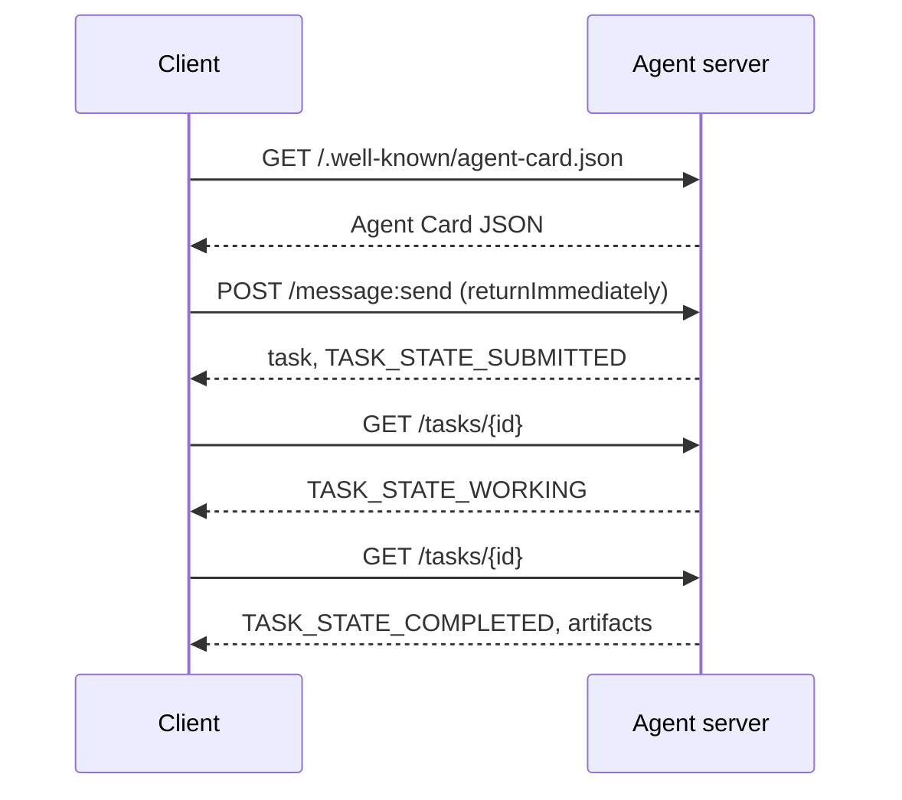

# A2A  Ajan-Ajan Protokolü

> Google, A2A'yı Nisan 2025'te duyurdu. Nisan 2026'a kadar özellikleri https://a2a-protocol.org/latest/specification/ve 150'den fazla kuruluş bunu destekliyor. A2A, MCP'nin yatay tamamlayıcıdır (Deneyim 13): MCP dikey (ajan  araçlar), A2A ise eşeğen (ajan  ajan). Agent Kartları (kaşif), eserlerle (metin, yapılandırılmış veriler, video), açık olmayan görev yaşam döngüleri ve ot. Üretim sistemleri giderek daha fazla MCP ile A2A eşleştirir. Google Cloud, 2025-2026 yılları boyunca Vertex AI Ajan Oluşturucu'na A2A desteğini ekledi.

**Type:** Learn + Build
**Languages:** Python (stdlib, `http.server`, `json`)
**Prerequisites:** Phase 16 · 04 (Primitive Model)
**Time:** ~75 minutes

## Sorun

Bu nedenle, bir diğer ajanın diğer bir sistemdeki başka bir ajanı araması gerekir. Nasıl? HTTP bir son noktasını ortaya koyabilir, özel bir JSON şeması tanımlayabilir ve diğer tarafın konuşmasını umarsınız. Her çift ajan özel bir entegrasyon haline gelir.

A2A, bu çağrı için evrensel kablo protokolüdür. Standart keşif, standart görev modeli, standart ulaşım, standart eserler. HTTP+REST gibi ama birinci sınıf vatandaşlar olarak ajanlar için.

## Anlam

### Dört unsur

**Agent Card.**JSON belgesini `/.well-known/agent-card.json`ajanın tanımlanması: isim, beceriler, `supportedInterfaces`(Son nokta URL, protokol bağlaması, protokol sürümü), varsayılan giriş ve çıkış medya türleri ve oth gereklilikleri (`securitySchemes`Ek olarak .`securityRequirements`Kartayı okuyarak keşfetmek mümkündür.

```http
GET /.well-known/agent-card.json HTTP/1.1
Host: agent.example.com
```

```json
{
  "name": "code-review-agent",
  "description": "Reviews Python and TypeScript code.",
  "version": "1.0.0",
  "supportedInterfaces": [
    {
      "url": "https://agent.example.com",
      "protocolBinding": "HTTP+JSON",
      "protocolVersion": "1.0"
    }
  ],
  "capabilities": {"streaming": false, "pushNotifications": false},
  "securitySchemes": {
    "bearer": {"httpAuthSecurityScheme": {"scheme": "Bearer"}}
  },
  "securityRequirements": [{"schemes": {"bearer": {"list": []}}}],
  "defaultInputModes": ["text/plain", "application/json"],
  "defaultOutputModes": ["application/json"],
  "skills": [
    {
      "id": "review-python",
      "name": "Review Python",
      "description": "Reviews Python code.",
      "tags": ["code-review", "python"]
    },
    {
      "id": "review-typescript",
      "name": "Review TypeScript",
      "description": "Reviews TypeScript code.",
      "tags": ["code-review", "typescript"]
    }
  ]
}
```

**Task.**İş birimi. Hayat döngüsü olan asynk, durumlu bir nesne:`TASK_STATE_SUBMITTED`→ `TASK_STATE_WORKING`→ `TASK_STATE_COMPLETED`- Ne ?`TASK_STATE_FAILED`- Ne ?`TASK_STATE_CANCELED`Bir istemci bir mesaj gönderir, sunucu görevi oluşturur ve istemci sondajlar yapar veya güncellemelere abone olur.

**Artifact.**Bir görev tarafından üretilen sonuç türü. Metin, yapılandırılmış JSON, görüntü, video, ses.`text`- Evet .`raw`- Evet .`url`veya`data`ve adını verebilir.`mediaType`Bu yüzden farklı modaliteler birinci sınıf.

**Opaque lifecycle.**A2A, uzaktan ajanın görevi nasıl çözeceğini belirlemez. Müşteri, durum geçişlerini ve eserleri görür; uygulamanın herhangi bir çerçeveyi kullanması özgürdür.

### MCP/A2A bölümü

- **MCP**(Deneyim 13): ajan  aracı. ajan bir araç sunucusuna JSON-RPC üzerinden okur/yazır. Öntanımlı olarak devletsiz.
- **A2A**-Agent  Agent.Per protokolü; her iki taraf da kendi akıl yürütme ile ajanlar.

Bir A2A eşleri tarafında MCP araçları çağırır.

### Bulma akışı



Bunlar HTTP+JSON bağlayıcı yolları ve her istek taşıyor `A2A-Version: 1.0`- Öntanımlı olarak .`SendMessage`Bu nedenle, bir oylama istemcisi, görevin bir terminal veya kesinti durumuna ulaşana kadar bloklar.`configuration.returnImmediately`Görevini hemen geri almak için.

Ya da akışla:`POST /message:stream`Server Gönderilen Olayları gönderir (a `task`Önce, sonra.`statusUpdate`ve `artifactUpdate`olaylar) ve `/tasks/{id}:subscribe`Çalışma bir göreve yeniden bağlanır. Görev bir terminal durumuna ulaştığında akım kapanır; hiçbir `final`Bayrak.

### Müellif

A2A üç ortak örneği destekler:

- **Bearer token**: OAuth2 veya açık olmayan (`httpAuthSecurityScheme`veya `oauth2SecurityScheme`)
- **mTLS**: karşılıklı TLS; kuruluşlar birbirlerine kimliklerini kanıtlar (`mtlsSecurityScheme`)
- **API key**: bir başlık, sorgu parametri veya çerez (`apiKeySecurityScheme`)

Autür , ajan kartında belirtilmiştir:`securitySchemes`Her bir programın adı ve `securityRequirements`Müşteriler bulup kabul etmeleri gerekenleri belirler.

### 150'den fazla kuruluş Nisan 2026'a kadar

İşletme kurulumu A2A ölçeğini hızlandırdı. Başlık: A2A, işletme ajan sistemlerinin güven sınırlarını geçmesinin yolu haline geldi. Google Cloud Vertex AI Agent Builder A2A desteğini gönderdi; Microsoft Agent Framework onu destekler; çoğu ana çerçeve (LangGraph, CrewAI, AutoGen) A2A adaptörlerini gönderdi.

### A2A'nın kazandığı yer

- **Cross-organization calls.**A şirketindeki ajan B şirketindeki ajanı arıyor. A2A olmadan her çift özel bir sözleşme olur.
- **Heterogeneous frameworks.**LangGraph ajanı CrewAI ajanı özel Python ajanı arıyor.
- **Typed artifacts.**Video sonucu, yapılandırılmış JSON, ses  hepsi birinci sınıf.
- **Long-running tasks.**Çürük yaşam döngüsü + anketler saatlerce süren görevleri kolaylaştırır.

### A2A'nın mücadele ettiği yer

- **Latency-sensitive micro-calls.**A2A'nın yaşam döngüsü asynk. Sub-millisecond ajan-a-agent uyumlu değil; doğrudan RPC kullanın.
- **Tight-coupled in-process agents.**Eğer her iki ajan da aynı Python işleminde çalışırsa, A2A'nın HTTP geri dönüş yolculuğu aşırı derecede.
- **Small teams.**Spec overhead gerçek; sadece içsel ajanlar için resmiye ihtiyaç duyulmayabilir.

### A2A vs ACP, ANP, NLIP

2024-2026 yıllarında ilgili birkaç özellik ortaya çıktı:

- **ACP**(IBM/Linux Vakfı)  A2A'nın öncesi, daha dar kapsam.
- **ANP**(Agent Network Protocol)  Eş-Kahtap-Kahtap-Kahtap, Merkezsiz-İlk.
- **NLIP**(Ecma Doğal Dil İşbirliği Protokolü, standartlaştırılmış Aralık 2025)  Doğal dil içerik türü.

A2A, Nisan 2026 itibariyle en çok kabul edilen eşler arası protokoldür. karşılaştırma için arXiv:2505.02279 (Liu et al., "A Survey of Agent Interoperability Protocols") bakınız.

```figure
sw-agent-card-discovery
```

## Yapın

`code/main.py`A2A-minimal bir sunucu ve istemci uyguluyor `http.server`ve JSON, 1.0 HTTP + JSON bağlamasında.

- Açıklamalar`/.well-known/agent-card.json`- Evet .
- kabul eder .`POST /message:send`- Evet .
- Görev durumu yönetir,
- Artefakları geri gönderir .`GET /tasks/{id}`- Evet .

Müşteri:

- Ajan kartını alır.
- ile bir mesaj gönderir `returnImmediately`- Evet .
- Seçimler tamamlanana kadar,
- - Bu eser okur.

Çık:

```
python3 code/main.py
```

Skenar, sunucuyu arka plan bir ipçeye başlatır, sonra da istemciyi ona karşı çalışır.

## Kullan

`outputs/skill-a2a-integrator.md`A2A entegrasyonu tasarlıyor: Agent Kart içeriği, görev skemeleri, yazar seçimi, akış ve anket.

## Gönder

Kontrol listesini:

- **Pin the spec version.**A2A hala gelişmekte .`supportedInterfaces`Giriş , kendi `protocolVersion`, ve müşteriler gönderir .`A2A-Version: 1.0`- Evet .
- **Idempotent task creation.**Tekrar gönderilen (ağ tekrar deneme) bir görev oluşturmalıdır.`messageId`- Evet .
- **Artifact schemas.**Ajanın hangi şekilleri gönderdiğini bildirin; tüketicilerin onaylaması gerekir.
- **Rate limits + auth.**A2A kamuya yöneliktir; standart web güvenliği uygulayın.
- **Dead-letter for failed tasks.**Sürekli aralıklı arıza türleri için zaman içinde kalıpları kontrol edin.

## Egzersizler

1. Çık .`code/main.py`Müşteri sunucuyu keşfettiğini ve doğru eseri aldığını onaylayın.
2. Bir ikinci beceri sunucuya ekleyin (örneğin, "cümle edin"). Ajan Kartı güncelleyin. Görev türüne göre beceri seçen bir istemci yazın. 1.0 talebi beceri alanı yoktur, bu nedenle sunucu mesaj parçalarına yönlendiriyor.
3. Uygulama`POST /message:stream`: cevap sunucu gönderilen olaylar ile (a `task`Önce, sonra.`statusUpdate`Bu nedenle, müşterinin farklı bir şekilde ne yapması gerekir?
4. A2A takvimini okuyun (https://a2a-protocol.org/latest/specification/Bu demo'nun uygulandığı üç konuyu belirleyin.
5. A2A (Agent Card keşfi) ile MCP (server tarafı yetenek listesi üzerinden) karşılaştırın `listTools`Kendini tanımlayan ajanlar ile yetenek denetleme arasındaki fark nedir?

## Anahtar Terimler

| Term | What people say | What it actually means |
|------|----------------|------------------------|
| A2A | "Agent-to-agent" | Peer protocol for agents to call other agents across systems. Google 2025. |
| Agent Card | "The agent's business card" | JSON at `/.well-known/agent-card.json` describing skills, `supportedInterfaces`, auth. |
| Task | "The unit of work" | Async stateful object with a lifecycle; artifacts produced on completion. |
| Artifact | "The result" | Typed output: text, structured JSON, image, video, audio. First-class media. |
| Opaque lifecycle | "How it's solved is the agent's business" | Client sees state transitions; server is free to choose framework/tools. |
| Discovery | "Finding the agent" | `GET /.well-known/agent-card.json` returns the card. |
| MCP vs A2A | "Tools vs peers" | MCP: vertical agent ↔ tool. A2A: horizontal agent ↔ agent. |
| ACP / ANP / NLIP | "Sibling protocols" | Adjacent specs; A2A is the most-adopted 2026. |

## Daha Fazla Okumak

- [A2A specification](https://a2a-protocol.org/latest/specification/) Kanonik özellik
- [A2A v1.0.1 release](https://github.com/a2aproject/A2A/tree/v1.0.1)Etiketlenmiş`docs/specification.md`ve `specification/a2a.proto`Bu ders
- [Google Developers Blog — A2A announcement](https://developers.googleblog.com/en/a2a-a-new-era-of-agent-interoperability/) Nisan 2025'te başlatma tarihi
- [A2A GitHub repo](https://github.com/a2aproject/A2A) Referans uygulamalar ve SDK'lar
- [Liu et al. — A Survey of Agent Interoperability Protocols](https://arxiv.org/html/2505.02279v1) MCP, ACP, A2A, ANP karşılaştırması
