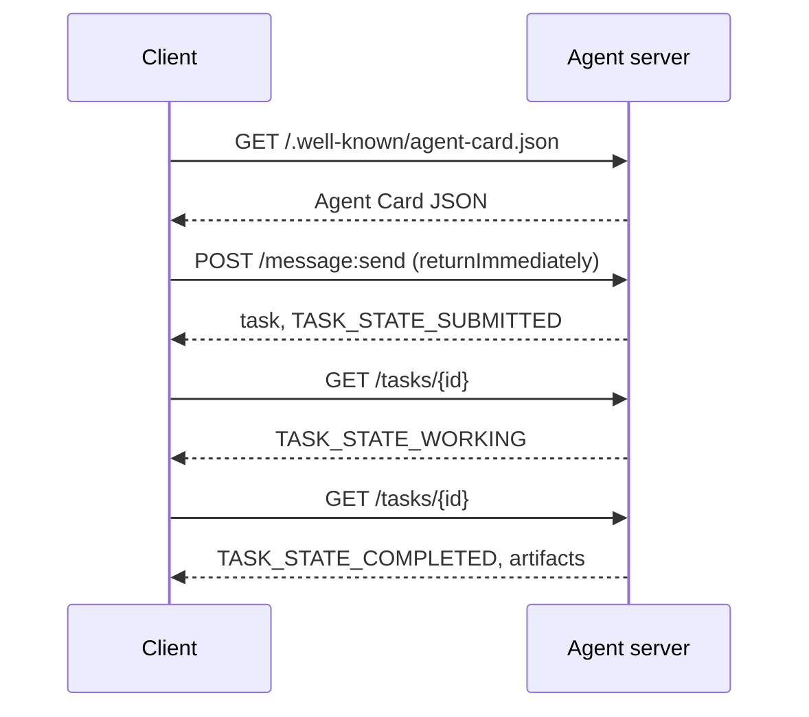

#  代理人间协议

> 谷歌于2026年4月宣布A2A;到2026年4月,https://a2a-protocol.org/latest/specification/其他150多个组织支持它. A2A是MCP的水平补充 (课13):MCP是垂直的 (代理工具),A2A是同等的 (代理代理). 它定义了代理卡 (发现),具有文物 (文本,结构数据,视频) 的任务,不透明的任务生命周期和 auth. 生产系统越来越多地将MCP与A2A结合起来. 在2025-2026年期间,谷歌云将A2A支持推向Vertex AI代理构建器.

**Type:** Learn + Build
**Languages:** Python (stdlib, `http.server`, `json`)
**Prerequisites:** Phase 16 · 04 (Primitive Model)
**Time:** ~75 minutes

## 问题

您的代理需要在另一个系统中调用另一个代理. 如何?您可以暴露HTTP终端点,定义一个定制的JSON方案,并希望另一方说. 每个对代理都会成为自定义集成.

作为一个"标准发现",标准任务模型,标准运输,标准文物.

## 概念

### 它们的四个元素

**Agent Card.**在 `/.well-known/agent-card.json`描述代理人:姓名,技能,`supportedInterfaces`(终点URL,协议绑定,协议版本),默认输入和输出媒体类型以及Auth要求 (`securitySchemes`另外`securityRequirements`发现是通过阅读卡.

```http
GET /.well-known/agent-card.json HTTP/1.1
Host: agent.example.com
```

```json
{
  "name": "code-review-agent",
  "description": "Reviews Python and TypeScript code.",
  "version": "1.0.0",
  "supportedInterfaces": [
    {
      "url": "https://agent.example.com",
      "protocolBinding": "HTTP+JSON",
      "protocolVersion": "1.0"
    }
  ],
  "capabilities": {"streaming": false, "pushNotifications": false},
  "securitySchemes": {
    "bearer": {"httpAuthSecurityScheme": {"scheme": "Bearer"}}
  },
  "securityRequirements": [{"schemes": {"bearer": {"list": []}}}],
  "defaultInputModes": ["text/plain", "application/json"],
  "defaultOutputModes": ["application/json"],
  "skills": [
    {
      "id": "review-python",
      "name": "Review Python",
      "description": "Reviews Python code.",
      "tags": ["code-review", "python"]
    },
    {
      "id": "review-typescript",
      "name": "Review TypeScript",
      "description": "Reviews TypeScript code.",
      "tags": ["code-review", "typescript"]
    }
  ]
}
```

**Task.**工作单位,一个没有同步的状态的对象,生命周期:`TASK_STATE_SUBMITTED`其他`TASK_STATE_WORKING`其他`TASK_STATE_COMPLETED`现在,`TASK_STATE_FAILED`现在,`TASK_STATE_CANCELED`客户端发送消息,服务器创建任务,客户端进行投票或订阅更新.

**Artifact.**任务所产生的结果类型:文字,结构化JSON,图像,视频,音频.`text`现在`raw`现在`url`其他`data`能给它一个名字`mediaType`它们的方法是最好的.

**Opaque lifecycle.**客户端可以看到状态过渡和文物;实现可以使用任何框架.

###  MCP/A2A 分裂

- **MCP**经纪人通过JSON-RPC读取/写入工具服务器.默认无状态.
- **A2A**两方都是有自己的推理的代理人.

两者都使用多代理系统. 一个A2A同行在其侧面调用MCP工具. 分裂使两个问题保持清洁.

### 发现流量



这些是HTTP+JSON绑定路线,每个请求都包含`A2A-Version: 1.0`默认情况下`SendMessage`测试客户端设置了`configuration.returnImmediately`让我们立即完成任务.

或是通过流媒体:`POST /message:stream`返回服务器发送事件 (a `task`首先,然后`statusUpdate`其他`artifactUpdate`事件) 和`/tasks/{id}:subscribe`流程在任务达到终端状态时关闭;没有`final`旗.

### 标签:

支持A2A的模式有三个常见:

- **Bearer token**: 质或不透明 (`httpAuthSecurityScheme`或`oauth2SecurityScheme`)
- **mTLS**互联网服务系统 (TLS);组织相互证明身份 (`mtlsSecurityScheme`)
- **API key**:一个标题,查询参数或cookie中的键 (`apiKeySecurityScheme`)

代理卡中表示:`securitySchemes`每个方案的名称和`securityRequirements`客户发现并遵守.

### 到2026年4月,将有150多个组织

企业采用推动了A2A规模.标题:A2A成为企业代理系统跨越信任界限的方式.谷歌云提供了Vertex AI代理构建器A2A支持;微软代理框架支持它;大多数主要框架 (LangGraph,CrewAI,AutoGen) 运送A2A适配器.

### 在A2A获胜的地方

- **Cross-organization calls.**没有A2A,每一个对都是个定制合同.
- **Heterogeneous frameworks.**拉格格拉夫代理调用CrewAI代理调用定制Python代理.
- **Typed artifacts.**视频结果,结构化JSON,音频所有都是一流的.
- **Long-running tasks.**模糊的生命周期+民意调查使得长达几个小时的任务变得简单.

### 亚2A在哪里努力

- **Latency-sensitive micro-calls.**亚2A的生命周期是异步的.
- **Tight-coupled in-process agents.**如果两个代理运行相同的Python进程, A2A的HTTP回路是过度的.
- **Small teams.**具体的通用费用是真实的; 只有内部代理人可能不需要正式的.

### 亚2A对ACP,ANP,NLIP

在2024-2026年出现了几个相关规格:

- **ACP** A2A的前身,范围较窄.
- **ANP**同行发现重,分散的第一.
- **NLIP**(Ecma自然语言互动协议,标准化2025年12月) 自然语言内容类型.

截至2026年4月,A2A是最多采用的同行协议. 参见 arXiv:2505.02279 (Liu等人",对代理互操作性协议的调查").

```figure
sw-agent-card-discovery
```

## 建立它

`code/main.py`实现A2A最小服务器和客户端使用`http.server`服务器:

- 暴露`/.well-known/agent-card.json`没有任何
- 接受`POST /message:send`没有任何
- 管理任务状态,
- 返回文物`GET /tasks/{id}`现在,我们要去.

客户:

- 拿到代理卡,
- 发送一个信息`returnImmediately`没有任何
- 投票直到完成,
- 读到文物.

运行:

```
python3 code/main.py
```

脚本将服务器启动在一个背景线程中,然后将客户端运行到它.

## 用它

`outputs/skill-a2a-integrator.md`设计A2A集成:代理卡内容,任务方案,作者选择,流媒体与民意调查.

## 运送它

检查列表:

- **Pin the spec version.**现在,A2A仍在发展,每一个`supportedInterfaces`报名声明其`protocolVersion`客户发送`A2A-Version: 1.0`现在,我们要去.
- **Idempotent task creation.**复制提交 (网络重试) 应产生一个任务.`messageId`现在,我们要去.
- **Artifact schemas.**声明代理返回的形状;消费者应验证.
- **Rate limits + auth.** A2A 面向公众; 应用标准的网络安全.
- **Dead-letter for failed tasks.**随着时间的推移,检查出现重复故障的模式.

## 运动

1. 跑步`code/main.py`确认客户发现服务器并收到正确的文物.
2. 添加第二个技能到服务器 (例如"总结").更新代理卡. 写一个基于任务类型的客户端选择技能. 1.0 请求没有技能领域,因此服务器将信息部分路由.
3. 实施`POST /message:stream`通过服务器发送事件 (a `task`首先,然后`statusUpdate`客户需要做什么不同?
4. 阅读A2A规格 (https://a2a-protocol.org/latest/specification/) 确定本示范没有执行的三个规范任务.
5. 比较A2A (代理卡发现) 和MCP (通过服务器端能力列表)`listTools`自我描述的代理人和能力测试之间的差别是什么?

## 关键词

| Term | What people say | What it actually means |
|------|----------------|------------------------|
| A2A | "Agent-to-agent" | Peer protocol for agents to call other agents across systems. Google 2025. |
| Agent Card | "The agent's business card" | JSON at `/.well-known/agent-card.json` describing skills, `supportedInterfaces`, auth. |
| Task | "The unit of work" | Async stateful object with a lifecycle; artifacts produced on completion. |
| Artifact | "The result" | Typed output: text, structured JSON, image, video, audio. First-class media. |
| Opaque lifecycle | "How it's solved is the agent's business" | Client sees state transitions; server is free to choose framework/tools. |
| Discovery | "Finding the agent" | `GET /.well-known/agent-card.json` returns the card. |
| MCP vs A2A | "Tools vs peers" | MCP: vertical agent ↔ tool. A2A: horizontal agent ↔ agent. |
| ACP / ANP / NLIP | "Sibling protocols" | Adjacent specs; A2A is the most-adopted 2026. |

## 进一步阅读

- [A2A specification](https://a2a-protocol.org/latest/specification/)法典规范
- [A2A v1.0.1 release](https://github.com/a2aproject/A2A/tree/v1.0.1)标签:`docs/specification.md`其他`specification/a2a.proto`这一课
- [Google Developers Blog — A2A announcement](https://developers.googleblog.com/en/a2a-a-new-era-of-agent-interoperability/)2025年4月发射时间
- [A2A GitHub repo](https://github.com/a2aproject/A2A)参考实施和SDK
- [Liu et al. — A Survey of Agent Interoperability Protocols](https://arxiv.org/html/2505.02279v1) MCP, ACP,A2A,ANP比较
